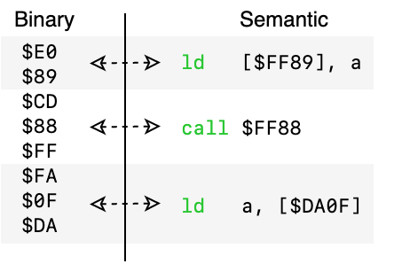
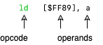

# Windfish CPU

The `CPU` module defines a protocol-based representation of a CPU's instruction set that can be used to translate between binary and semantic representations of instructions.

<p align="center">
  
</p>

### Introduction

Every instruction in a CPU's instruction set has a unique binary footprint.
This footprint represents one or more bytes in memory starting with the instruction's **opcode** and ending with the instruction's **immediate**, if the opcode requires one.

Each byte of the opcode corresponds to a location in a lookup table describing the intended shape and behavior of the instruction.
[See an example of a lookup table for the Gameboy CPU](https://www.pastraiser.com/cpu/gameboy/gameboy_opcodes.html).

Many instructions have an immediate.
An immediate is one or more bytes of additional information that can augment the behavior of the instruction.
For example, the Gameboy CPU opcode `$E0` corresponds to an instruction of the form `LD [$FF00+(a8)], a` which requires an 8-bit (one byte) immediate.
This means that `$E0 $89` is represented as `ld [$FF89], a` in assembly.

> Note: when an instruction is written in assembly form, each comma-separated value after the opcode is called an *operand*.
> Some operands are implicit in the opcode's instruction definition, while others come from the immediate.

<p align="center">
  
</p>

### Overview

The `CPU` module represents instruction sets using three important types:

- `InstructionSpec`: describes a specific instruction's binary footprint.
- `InstructionSet`: translates a series of opcode bytes into an `InstructionSpec`.
- `Instruction`: represents a CPU instruction as an `InstructionSpec` and the value of its immediate, if it has one.

### Defining the shape of an instruction

Describing a CPU's instruction set starts by implementing the `InstructionSpec` protocol as a Swift enum.
Using a Swift enum enables us to represent opcodes in a format that is similar to their assembly language equivalent.

Let's define a spec for a hypothetical instruction set consisting of four instruction types:

```swift
enum Spec: CPU.InstructionSpec {
  typealias AddressType = UInt16

  case nop
  case cp(Numeric)
  case ld(Numeric, Numeric)
  case call(Condition? = nil, Numeric)

  enum Numeric: Hashable, CPU.ImmediateOperand {
    case imm8
    case imm16
    case a

    var width: Int {
      switch self {
      case .imm8:  return 1
      case .imm16: return 2
      default:     return 0
      }
    }
  }

  enum Condition: Hashable {
    case nz
    case z
  }
}
```

> Note: `InstructionSpec` provides a default implementation of `opcodeWidth` and `operandWidth` that uses Swift's `Mirror` type to infer the opcode and immediate widths from the enum's semantic structure.
> Operands that can be represented as an imemdiate need only to conform to the `CPU.ImmediateOperand` type and explicitly specify the width of each operand.

The `Spec` type now allows us to represent any of the following instructions (including some non-sensical ones):

```swift
.nop
.cp(.a)
.cp(.imm8)
.ld(.a, .imm8)
.call(nil, .imm16)
.call(.z, .imm16)
.ld(.imm8, .imm8)
```

### Defining an instruction set

Now that we've defined the shape of our assembly language using the `Spec` type, let's define the set of valid instructions using `InstructionSet`.

An `InstructionSet` is essentially just a wrapper around one or more opcode lookup tables, as represented like so:

```swift
static let table: [Spec] = [
  /* 0x00 */ .nop,
  /* 0x01 */ .ld(.a, .imm8),
  /* 0x02 */ .ld(.a, .imm16),
  /* 0x03 */ .call(.nz, .imm16),
  /* 0x04 */ .call(nil, .imm16),
]
```

This table can then be placed within an `InstructionSet`:

```swift
struct InstructionSet: CPU.InstructionSet {
  static let table: [Spec] = [
    /* 0x00 */ .nop,
    /* 0x01 */ .ld(.a, .imm8),
    /* 0x02 */ .ld(.a, .imm16),
    /* 0x03 */ .call(.nz, .imm16),
    /* 0x04 */ .call(nil, .imm16),
  ]
}
```

We can now use the default `InstructionSet` methods to wire up the relevant values that are required as part of the protocol:

```swift
struct InstructionSet: CPU.InstructionSet {
  // ...

  static var widths: [Spec: InstructionWidth<UInt16>] = {
    return computeAllWidths()
  }()

  static var opcodeBytes: [Spec: [UInt8]] = {
    return computeAllOpcodeBytes()
  }()

  static var opcodeStrings: [Spec: String] = {
    return computeAllOpcodeStrings()
  }()

  public static var reflectedArgumentTypes: [Spec: Any] = {
    return computeAllReflectedArgumentTypes()
  }()
}
```

The default `InstructionSet` methods make the following assumptions:

1. The `Instruction.Spec` is implemented as a Swift enum.
2. Each `table` index directly corresponds to the numerical representation of the corresponding `Instruction.Spec`'s opcode.
3. Each enum case value corresponds to the assembly representation of that opcode or operand. E.g. `.call` will be represented as `call` in assembly.

### Defining an instruction

An instruction consists of a specification and any immediate values associated with the instruction. 

```swift
struct Instruction: CPU.Instruction {
  typealias InstructionSetType = InstructionSet

  let spec: Spec
  let immediate: ImmediateValue?

  enum ImmediateValue: CPU.InstructionImmediate {
    case imm8(UInt8)
    case imm16(UInt16)
  }
}
```

For example, `.ld(.a, .imm8)` expects an 8-bit immediate which would look like so:

```swift
let instruction = Instruction(spec: .ld(.a, .imm8), immediate: .imm8(127))
```

### Bringing it all together

We've now defined the three essential components of a CPU's instruction set.
The `CPU` module provides a variety of utilities that work out-of-the-box once these three types have been established.
Provided below is a cookbook of common workflows.

#### Disassembling instructions from data

```swift
let data = Data([0x01, 0xAB])
let instruction: Instruction = Instruction.from(data)
```

#### Assembling instructions to data

```swift
let data: Data = instruction.asData()
```

#### Getting the width of an instruction's opcode

```swift
let width: Int = InstructionSet.widths[.ld(.a, .imm8)].opcode
```

#### Getting the width of an instruction's immediate

```swift
let width: Int = InstructionSet.widths[.ld(.a, .imm8)].immediate
```

#### Getting the string representation of an opcode

```swift
let opcode: String = InstructionSet.opcodeStrings[.ld(.a, .imm8)]
```

#### Getting the byte representation of an opcode

```swift
let opcode: String = InstructionSet.opcodeBytes[.ld(.a, .imm8)]
```
