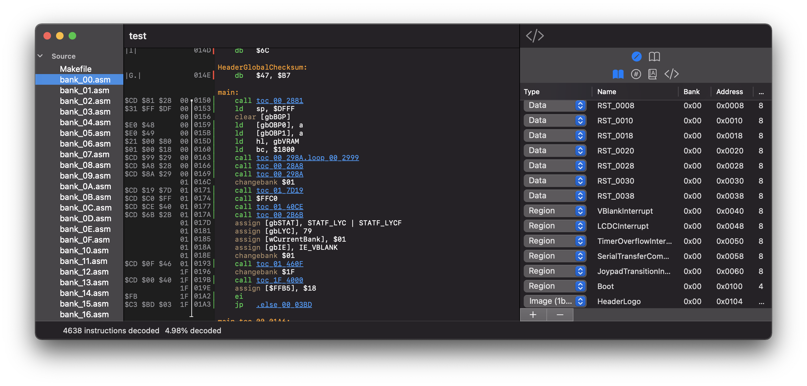

# Windfish

Windfish is a disassembler for Gameboy ROMs that can generate [RBGDS](https://github.com/gbdev/rgbds)-compatible assembly code.

## Background

This project was initiated to support [archaelogical efforts](https://kemenaran.winosx.com/posts/category-disassembling-links-awakening) aimed at understanding the implementation details behind Link's Awakening for the original Gameboy. The project has since grown to be a general disassembler for Gameboy ROMs.

The name "Windfish" is a reference to the main focus of the Link's Awakening storyline.

## Overview

The core design principle of the Windfish disassembler is to maximize legibility of generated assembly code with minimal configuration.

Windfish supports several powerful features for disassembling Gameboy ROMs, including:

- **Control-flow disassembly**: Able to follow branches in control flow in order to distinguish code from binary data.
- **Memory bank awareness**: Bank changes are monitored so that jumps to 0x4000-0x7999 memory regions can move to the correct bank.
- **Regions**: Text, image (2bpp, 1bpp), and data regions can be registered enabling a rich representation of the disassembly in KoholintIsland. 
- **Data types**: Custom datatypes can be registered and, when detected, automatically referenced in the generated assembly to improve code readability.
- **Globals**: Global variables can be registered and referred to within the generated assembly.
- **Macros**: Common assembly patterns can be registered and, when detected, generated as RGBDS macros.
- **Scope awareness**: Contiguous blocks of scope are inferred during disassembly.

## KoholintIsland

The Windfish disassembler is best invoked through the KoholintIsland front-end application.

## Emulation test matrix

The Windfish emulator is validated against test ROMs in order to ensure consistency + completeness of the implementation.

| Test suite | Test name | Status |
|:----------|:-----|:--------|
| [blargg](https://gbdev.gg8.se/files/roms/blargg-gb-tests/) | `01-special` | ✅ |
| [blargg](https://gbdev.gg8.se/files/roms/blargg-gb-tests/) | `02-interrupts.gb` | ❌ |
| [blargg](https://gbdev.gg8.se/files/roms/blargg-gb-tests/) | `03-op sp,hl.gb` | ✅ |
| [blargg](https://gbdev.gg8.se/files/roms/blargg-gb-tests/) | `04-op r,imm.gb` | ✅ |
| [blargg](https://gbdev.gg8.se/files/roms/blargg-gb-tests/) | `05-op rp.gb` | ✅ |
| [blargg](https://gbdev.gg8.se/files/roms/blargg-gb-tests/) | `06-ld r,r.gb` | ✅ |
| [blargg](https://gbdev.gg8.se/files/roms/blargg-gb-tests/) | `07-jr,jp,call,ret,rst.gb` | ✅ |
| [blargg](https://gbdev.gg8.se/files/roms/blargg-gb-tests/) | `08-misc instrs.gb` | ✅ |
| [blargg](https://gbdev.gg8.se/files/roms/blargg-gb-tests/) | `09-op r,r.gb` | ❌ |
| [blargg](https://gbdev.gg8.se/files/roms/blargg-gb-tests/) | `10-bit ops.gb` | ✅ |
| [blargg](https://gbdev.gg8.se/files/roms/blargg-gb-tests/) | `11-op a,(hl).gb` | ❌ |

## Learn more

[Learn more about the Windfish architecture](lib/README.md).
