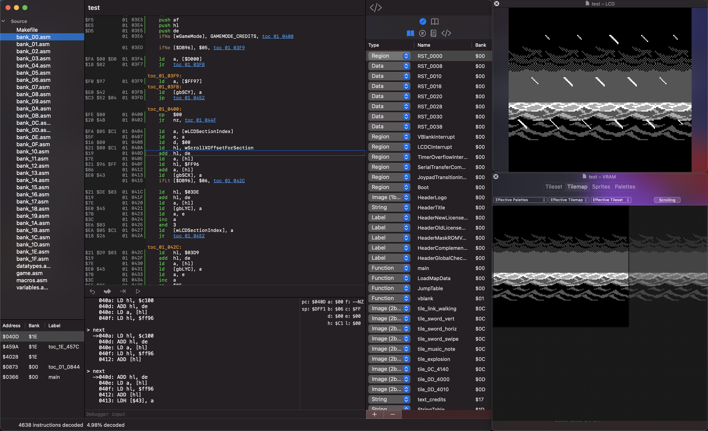

# Windfish

Windfish is a disassembler for Gameboy ROMs that can generate [RBGDS](https://github.com/gbdev/rgbds)-compatible assembly code.

## Background

This project was initiated to support [archaelogical efforts](https://kemenaran.winosx.com/posts/category-disassembling-links-awakening) aimed at understanding the implementation details behind Link's Awakening for the original Gameboy. The project has since grown to be a general disassembler for Gameboy ROMs.

The name "Windfish" is a reference to the main focus of the Link's Awakening storyline.

## Overview

The core design principle of the Windfish disassembler is to maximize legibility of generated assembly code with minimal configuration.

Windfish supports several powerful features for disassembling Gameboy ROMs, including:

- **Control-flow disassembly**: Able to follow branches in control flow in order to distinguish code from binary data.
- **Memory bank awareness**: Bank changes are monitored so that jumps to 0x4000-0x7999 memory regions can move to the correct bank.
- **Regions**: Text, image (2bpp, 1bpp), and data regions can be registered enabling a rich representation of the disassembly in the Windfish IDE. 
- **Data types**: Custom datatypes can be registered and, when detected, automatically referenced in the generated assembly to improve code readability.
- **Globals**: Global variables can be registered and referred to within the generated assembly.
- **Macros**: Common assembly patterns can be registered and, when detected, generated as RGBDS macros.
- **Scope awareness**: Contiguous blocks of scope are inferred during disassembly.

### IDE

The Windfish disassembler is best invoked through the IDE which is integrated closely with the powerful [Sameboy emulator and debugger](http://github.com/LIJI32/SameBoy/).

Features of the IDE:

- **Full Sameboy debugger integration**: See https://sameboy.github.io/debugger/ for complete documentation on the debugger.
- **Full Sameboy emulation**: This enables a tight feedback loop where emulation can be used to increase your understanding of the disassembly.
- **Configuration editing**: Edit regions, data types, globals, and macros from the IDE.
- **Labeled callstack**: The labels are read directly from the full-context disassembly.
- **Tooltip documentation**: Documentation for instructions can be seen by hovering over the instruction.
- **Function scope visualization**: Function scopes are shown as a contiguous line alongside the source.
- **Selected bank visualization**: The selected bank is shown alongside each instruction.

## Learn more

[Learn more about the Windfish architecture](lib/README.md).
