# Windfish

Windfish is a disassembler for Gameboy ROMs that can generate [RBGDS](https://github.com/gbdev/rgbds)-compatible assembly code.

## Background

This project was initiated to support [archaelogical efforts](https://kemenaran.winosx.com/posts/category-disassembling-links-awakening) aimed at understanding the implementation details behind Link's Awakening for the original Gameboy. The project has since grown to be a general disassembler for Gameboy ROMs.

The name "Windfish" is a reference to the main focus of the Link's Awakening storyline.

## Overview

The core design principle of the Windfish disassembler is to maximize legibility of generated assembly code with minimal configuration.

Windfish supports several powerful features for disassembling Gameboy ROMs, including:

- **Control-flow disassembly**: Able to follow branches in control flow in order to distinguish code from binary data.
- **Memory bank awareness**: Bank changes are monitored so that jumps to 0x4000-0x7999 memory regions can move to the correct bank.
- **Regions**: Text, image (2bpp, 1bpp), and data regions can be registered enabling a rich representation of the disassembly in KoholintIsland. 
- **Data types**: Custom datatypes can be registered and, when detected, automatically referenced in the generated assembly to improve code readability.
- **Globals**: Global variables can be registered and referred to within the generated assembly.
- **Macros**: Common assembly patterns can be registered and, when detected, generated as RGBDS macros.
- **Scope awareness**: Contiguous blocks of scope are inferred during disassembly.

## KoholintIsland

The Windfish disassembler is best invoked through the KoholintIsland front-end application.

## Reference material

Technical references:

- [Game Boy: Complete Technical Reference](https://github.com/Gekkio/gb-ctr)
- [Game Boy: Complete Technical Reference (pdf)](https://gekkio.fi/files/gb-docs/gbctr.pdf)
- [Game Boy CPU Manual](https://realboyemulator.files.wordpress.com/2013/01/gbcpuman.pdf)
- [Pan Docs](https://gbdev.io/pandocs/)
- [GameBoy Memory Map](http://gameboy.mongenel.com/dmg/asmmemmap.html)

On accuracy:

- [Mooneye GB: A Gameboy emulator written in Rust](https://gekkio.fi/blog/2015/mooneye-gb-a-gameboy-emulator-written-in-rust/)
- [Nitty Gritty Gameboy Cycle Timing](http://blog.kevtris.org/blogfiles/Nitty%20Gritty%20Gameboy%20VRAM%20Timing.txt)

PPU:

- [Writing an emulator: the first pixel](https://blog.tigris.fr/2019/09/15/writing-an-emulator-the-first-pixel/))

Test ROMs:

- [Mooneye GB](https://github.com/Gekkio/mooneye-gb/tree/master/tests)
- [blargg](https://gbdev.gg8.se/files/roms/blargg-gb-tests/)
- [mealybug-tearoom](https://github.com/mattcurrie/mealybug-tearoom-tests)
- [Gambatte](https://github.com/sinamas/gambatte/tree/master/test/hwtests)
- [Game Boy test ROM do's and don'ts](https://gekkio.fi/blog/2016/game-boy-test-rom-dos-and-donts/)

Open source emulators with both fifo PPU and cycle-accuracy:

- [coffee-gb](https://github.com/trekawek/coffee-gb/tree/master/src/main/java/eu/rekawek/coffeegb)
- [Sameboy](https://github.com/LIJI32/SameBoy)
  - Code can be a bit difficult to follow because cycles can be executed from anywhere and there is some goto/lable magic happening with GB_STATE_MACHINE.

  Other open source emulators:

- [mame](https://github.com/mamedev/mame/tree/30371b5717b3aa88da7f3d19235821f7eca0d429/src/devices/cpu/lr35902)
- [BremuGb](https://github.com/Briensturm/BremuGb/tree/78dfd4bb469637892596017c354a0fd1a74f0855/Src/BremuGb.Lib)
- [SpecBoy](https://github.com/spec-chum/SpecBoy)
- [giibiiadvance](https://github.com/AntonioND/giibiiadvance)

Videos:

- [The Ultimate Game Boy Talk (33c3)](https://www.youtube.com/watch?v=HyzD8pNlpwI&t=29m19s)

## Emulation test matrix

The Windfish emulator is validated against test ROMs in order to ensure consistency + completeness of the implementation.

### [blargg](https://gbdev.gg8.se/files/roms/blargg-gb-tests/)

<table>
<tr>
<td colspan="4"><code>cpu_instrs/</code></td>
</tr>
<tr>
<td align="center">
✅ <code>01-special</code>
</td>
<td align="center">
✅ <code>02-interrupts.gb</code>
</td>
<td align="center">
✅ <code>03-op sp,hl.gb</code>
</td>
<td align="center">
✅ <code>04-op r,imm.gb</code>
</td>
</tr><tr>
<td align="center">
✅ <code>05-op rp.gb</code>
</td>
<td align="center">
✅ <code>06-ld r,r.gb</code>
</td>
<td align="center">
✅ <code>07-jr,jp,call,ret,rst.gb</code>
</td>
<td align="center">
✅ <code>08-misc instrs.gb</code>
</td>
</tr><tr>
<td align="center">
✅ <code>09-op r,r.gb</code>
</td>
<td align="center">
✅ <code>10-bit ops.gb</code>
</td>
<td align="center">
✅ <code>11-op a,(hl).gb</code>
</td>
</tr><tr>
<td colspan="4"><code>interrupt_time/</code></td>
</tr><tr>
<td align="center">
❌ <code>instr_timing</code>
 🐞<a href="https://github.com/jverkoey/windfish/issues/18">#18</a></td>
</tr><tr>
<td colspan="4"><code>instr_timing/</code></td>
</tr><tr>
<td align="center">
✅ <code>instr_timing</code>
</td>
</tr><tr>
<td colspan="4"><code>mem_timing/</code></td>
</tr><tr>
<td align="center">
✅ <code>01-read_timing</code>
</td>
<td align="center">
✅ <code>02-write_timing</code>
</td>
<td align="center">
✅ <code>03-modify_timing</code>
</td>
</tr>
</table>

### [mooneye](https://github.com/Gekkio/mooneye-gb/)

<table>
<tr>
<td colspan="4"><code>acceptance/bits/</code></td>
</tr><tr>
<td align="center">
❌ <code>mem_oam</code>
</td>
<td align="center">
✅ <code>reg_f</code>
</td>
<td align="center">
❌ <code>unused_hwio-GS</code>
</td>
</tr><tr>
<td colspan="4"><code>acceptance/daa/</code></td>
</tr><tr>
<td align="center">
✅ <code>daa</code>
</td>
</tr><tr>
<td colspan="4"><code>acceptance/interrupts/</code></td>
</tr><tr>
<td align="center">
❌ <code>ie_push</code>
</td>
</tr><tr>
<td colspan="4"><code>acceptance/oam_dma/</code></td>
</tr><tr>
<td align="center">
❌ <code>basic</code>
</td>
<td align="center">
✅ <code>reg_read</code>
</td>
<td align="center">
❌ <code>sources-GS</code>
</td>
</tr><tr>
<td colspan="4"><code>acceptance/ppu/</code></td>
</tr><tr>
<td align="center">
❌ <code>hblank_ly_scx_timing-GS</code>
</td>
<td align="center">
❌ <code>intr_1_2_timing-GS</code>
</td>
<td align="center">
❌ <code>intr_2_0_timing</code>
</td>
<td align="center">
❌ <code>intr_2_mode0_timing_sprites</code>
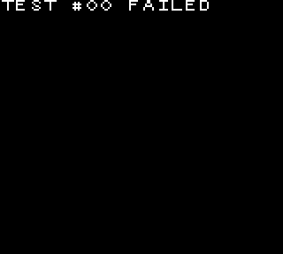</td>
</tr><tr>
<td align="center">
✅ <code>intr_2_mode0_timing</code>
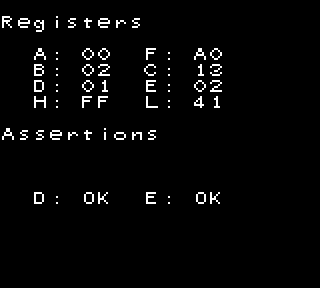</td>
<td align="center">
✅ <code>intr_2_mode3_timing</code>
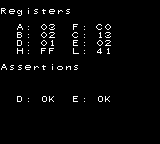</td>
<td align="center">
✅ <code>intr_2_oam_ok_timing</code>
</td>
<td align="center">
❌ <code>stat_lyc_onoff</code>
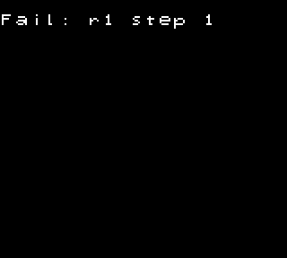</td>
</tr><tr>
<td align="center">
✅ <code>vblank_stat_intr-GS</code>
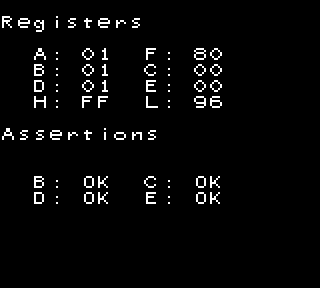</td>
</tr><tr>
<td colspan="4"><code>acceptance/</code></td>
</tr><tr>
<td align="center">
❌ <code>add_sp_e_timing</code>
</td>
<td align="center">
✅ <code>boot_div-dmgABCmgb</code>
</td>
<td align="center">
❌ <code>boot_regs-dmg0</code>
</td>
<td align="center">
✅ <code>boot_regs-dmgABC</code>
</td>
</tr><tr>
<td align="center">
❌ <code>boot_hwio-dmgABCmgb</code>
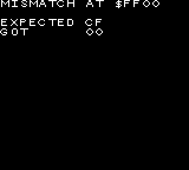</td>
<td align="center">
❌ <code>call_timing</code>
</td>
<td align="center">
✅ <code>div_timing</code>
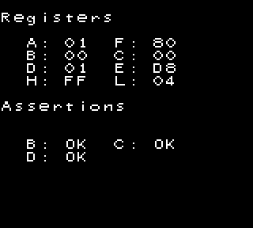</td>
<td align="center">
❌ <code>ei_sequence</code>
</td>
</tr><tr>
<td align="center">
❌ <code>ei_timing</code>
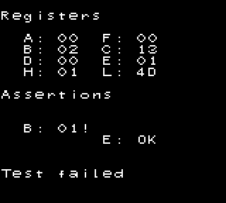</td>
<td align="center">
❌ <code>if_ie_registers</code>
</td>
<td align="center">
✅ <code>intr_timing</code>
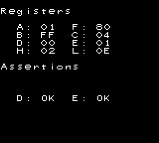</td>
<td align="center">
❌ <code>jp_timing</code>
</td>
</tr><tr>
<td align="center">
✅ <code>oam_dma_restart</code>
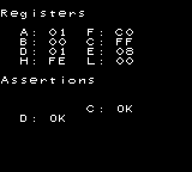</td>
<td align="center">
✅ <code>oam_dma_start</code>
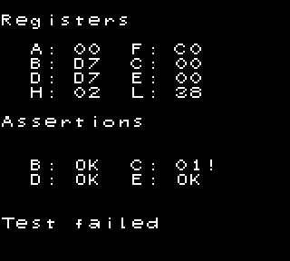</td>
<td align="center">
✅ <code>oam_dma_timing</code>
</td>
<td align="center">
✅ <code>pop_timing</code>
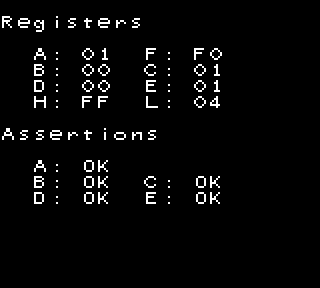</td>
</tr><tr>
<td align="center">
❌ <code>push_timing</code>
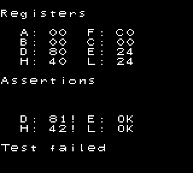</td>
<td align="center">
❌ <code>rapid_di_ei</code>
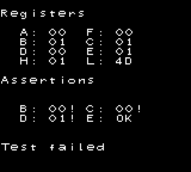</td>
<td align="center">
❌ <code>rst_timing</code>
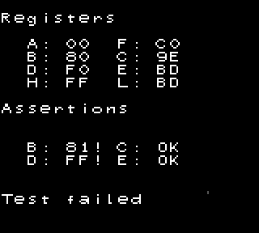</td>
</tr><tr>
<td colspan="4"><code>emulator-only/mbc1/</code></td>
</tr><tr>
<td align="center">
✅ <code>bits_bank1</code>
</td>
</tr>
</table>

### [Mealybug Tearoom](https://github.com/mattcurrie/mealybug-tearoom-tests)

<table>
<tr>
<td align="center">
❌ <code>m3_lcdc_bg_en_change</code>
</td>
<td align="center">
❌ <code>m3_lcdc_bg_en_change</code>
</td>
<td align="center">
❌ <code>m3_scy_change</code>
</td>
<td align="center">
❌ <code>m3_wx_4_change</code>
</td>
</tr><tr>
<td align="center">
❌ <code>m3_wx_5_change</code>
</td>
<td align="center">
❌ <code>m3_wx_6_change</code>
</td>
</tr>
</table>

## Learn more

[Learn more about the Windfish architecture](lib/README.md).
