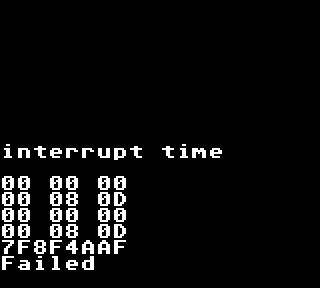
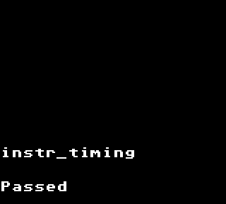
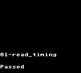
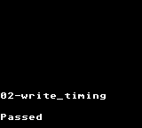
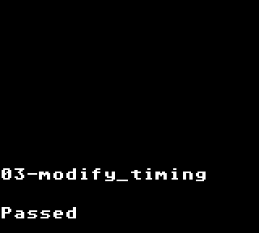
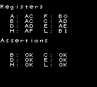
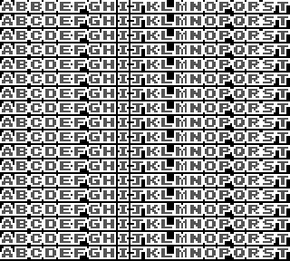
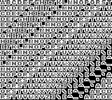
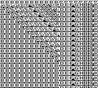

# Windfish

Windfish is a disassembler for Gameboy ROMs that can generate [RBGDS](https://github.com/gbdev/rgbds)-compatible assembly code.

## Background

This project was initiated to support [archaelogical efforts](https://kemenaran.winosx.com/posts/category-disassembling-links-awakening) aimed at understanding the implementation details behind Link's Awakening for the original Gameboy. The project has since grown to be a general disassembler for Gameboy ROMs.

The name "Windfish" is a reference to the main focus of the Link's Awakening storyline.

## Overview

The core design principle of the Windfish disassembler is to maximize legibility of generated assembly code with minimal configuration.

Windfish supports several powerful features for disassembling Gameboy ROMs, including:

- **Control-flow disassembly**: Able to follow branches in control flow in order to distinguish code from binary data.
- **Memory bank awareness**: Bank changes are monitored so that jumps to 0x4000-0x7999 memory regions can move to the correct bank.
- **Regions**: Text, image (2bpp, 1bpp), and data regions can be registered enabling a rich representation of the disassembly in KoholintIsland. 
- **Data types**: Custom datatypes can be registered and, when detected, automatically referenced in the generated assembly to improve code readability.
- **Globals**: Global variables can be registered and referred to within the generated assembly.
- **Macros**: Common assembly patterns can be registered and, when detected, generated as RGBDS macros.
- **Scope awareness**: Contiguous blocks of scope are inferred during disassembly.

## KoholintIsland

The Windfish disassembler is best invoked through the KoholintIsland front-end application.

## Emulation test matrix

The Windfish emulator is validated against test ROMs in order to ensure consistency + completeness of the implementation.

### [blargg](https://gbdev.gg8.se/files/roms/blargg-gb-tests/)

<table>
<tr>
<td colspan="4"><code>cpu_instrs/</code></td>
</tr>
<tr>
<td align="center">
✅ <code>01-special</code>
</td>
<td align="center">
✅ <code>02-interrupts.gb</code>
</td>
<td align="center">
✅ <code>03-op sp,hl.gb</code>
</td>
<td align="center">
✅ <code>04-op r,imm.gb</code>
</td>
</tr><tr>
<td align="center">
✅ <code>05-op rp.gb</code>
</td>
<td align="center">
✅ <code>06-ld r,r.gb</code>
</td>
<td align="center">
✅ <code>07-jr,jp,call,ret,rst.gb</code>
</td>
<td align="center">
✅ <code>08-misc instrs.gb</code>
</td>
</tr><tr>
<td align="center">
✅ <code>09-op r,r.gb</code>
</td>
<td align="center">
✅ <code>10-bit ops.gb</code>
</td>
<td align="center">
✅ <code>11-op a,(hl).gb</code>
</td>
</tr><tr>
<td colspan="4"><code>interrupt_time/</code></td>
</tr><tr>
<td align="center">
❌ <code>instr_timing</code>
 🐞<a href="https://github.com/jverkoey/windfish/issues/18">#18</a></td>
</tr><tr>
<td colspan="4"><code>instr_timing/</code></td>
</tr><tr>
<td align="center">
✅ <code>instr_timing</code>
</td>
</tr><tr>
<td colspan="4"><code>mem_timing/</code></td>
</tr><tr>
<td align="center">
✅ <code>01-read_timing</code>
</td>
<td align="center">
✅ <code>02-write_timing</code>
</td>
<td align="center">
✅ <code>03-modify_timing</code>
</td>
</tr>
</table>

### [mooneye](https://github.com/Gekkio/mooneye-gb/)

<table>
<tr>
<td colspan="4"><code>acceptance/bits/</code></td>
</tr><tr>
<td align="center">
❌ <code>mem_oam</code>
</td>
<td align="center">
✅ <code>reg_f</code>
</td>
<td align="center">
❌ <code>unused_hwio-GS</code>
</td>
</tr><tr>
<td colspan="4"><code>acceptance/daa/</code></td>
</tr><tr>
<td align="center">
✅ <code>daa</code>
</td>
</tr><tr>
<td colspan="4"><code>acceptance/interrupts/</code></td>
</tr><tr>
<td align="center">
❌ <code>ie_push</code>
</td>
</tr><tr>
<td colspan="4"><code>acceptance/oam_dma/</code></td>
</tr><tr>
<td align="center">
❌ <code>basic</code>
</td>
<td align="center">
✅ <code>reg_read</code>
</td>
<td align="center">
❌ <code>sources-GS</code>
</td>
</tr><tr>
<td colspan="4"><code>acceptance/</code></td>
</tr><tr>
<td align="center">
❌ <code>add_sp_e_timing</code>
</td>
<td align="center">
✅ <code>boot_div-dmgABCmgb</code>
</td>
<td align="center">
❌ <code>boot_regs-dmg0</code>
</td>
<td align="center">
✅ <code>boot_regs-dmgABC</code>
</td>
</tr><tr>
<td align="center">
❌ <code>call_timing</code>
</td>
</tr><tr>
<td colspan="4"><code>emulator-only/mbc1/</code></td>
</tr><tr>
<td align="center">
✅ <code>bits_bank1</code>
</td>
</table>

### [Mealybug Tearoom](https://github.com/mattcurrie/mealybug-tearoom-tests)

| Test name | Status | Screenshot |
|:-----|:--------|:----|
| `m3_lcdc_bg_en_change` | ❌ |  |
| `m3_lcdc_bg_en_change` | ❌ |  |
| `m3_scy_change` | ❌ |  |
| `m3_wx_4_change` | ❌ |  |
| `m3_wx_5_change` | ❌ |  |
| `m3_wx_6_change` | ❌ |  |

## Learn more

[Learn more about the Windfish architecture](lib/README.md).
