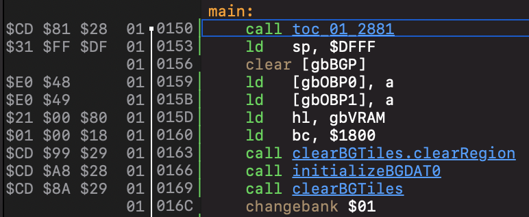

On the leading edge of each line of assembly in the Source pane is what's called the *context area*.

This area includes five important pieces of information, in order from left to right:

1. The binary representation of the line, if it fits.
2. The most likely selected bank after execution of this line.
3. A scope marker.
4. The address of the line.
5. The line's disassembly status.

## Binary representation

The first column of information in the context area attempts to show the binary representation of the instruction on that line.

If the instruction on that line is represented by more than three bytes of information, then no information is shown. [Issue #36](https://github.com/jverkoey/windfish/issues/36) is tracking improvements to this.

## Selected bank

The Gameboy accesses game's ROM using a banked memory system that persists the state of a selected ROM bank over time.
The second column of the context area shows Windfish's understanding of what the most likely selected bank is based on prior instructions that have been traced.

## Scope marker

The scope marker indicates when a block of instructions are executed in sequence as part of a label.
The scope marker line can be a quick way to get a sense of where the beginning of a block of instructions is.

## Line address

The line address shows the starting address of the line's binary representation.

## Disassembly status

Windfish uses the disassembly status line to indicate whether it has a clear understanding of the type of information at that line.
The colors scheme:

- Green: Windfish is certain this line is code.
- Gray: Windfish is certain this line is data or text.
- Red: Windfish does not know what kind of information is at this line. The line defaults to being treated as data.
