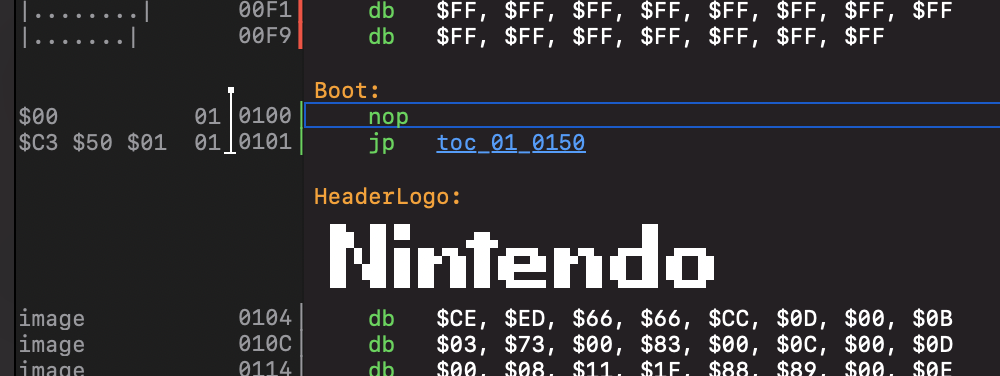
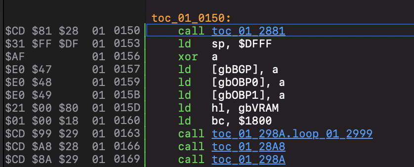
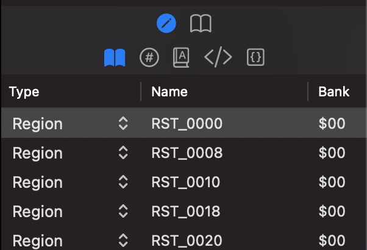
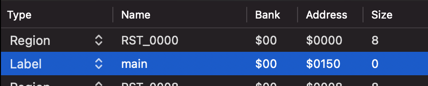

The typical Windfish disassembly workflow involves the following three steps performed in a loop:

1. Emulate the ROM, observing the impact of various instructions on the state of the program.
2. Infer the intent of the behavior and adjust the project's configuration to reflect that.
3. Re-run the disassembler.

This article will walk you through a single iteration of this workflow using the Link's Awakening ROM for the original Gameboy.
It is assumed that you have already started a project, loaded the ROM, and are working with the default project configuration.

## Step 1: Emulating the ROM

Before we start emulation, we'll put a breakpoint at the program's starting point so that we can step through its initial instructions.
Type the following into the console:

```
breakpoint $100
```

This will set a breakpoint at the address `$0100`, which is the hexidecimal address of the game's first instruction after Sameboy's startup sequence.

Start emulation by clicking the play button in the Console pane.


Once Sameboy's startup sequence completes, the debugger will pause execution at line `$0100` and jump the Source view to that location.



Note that the next instruction to be executed by the emulator is now outlined in the Source view.

Now that a breakpoint has been hit, we can advance the emulation one step at a time using either the *Step Into* or the *Step Over* command.

- **Step Into** always emulates one instruction at a time
- **Step Over** is similar to *Step Into*, except that when it encounters a `call` instruction it continues emulating until the call is returned.

Click step over until we're at line `$0150`.



This address is typically the actual entry-point of the application, so let's update the label to reflect that.

## Step 2: Updating the project configuration

When Windfish doesn't know the name of a label at a given location, it creates a default one using the label's banked address.
In this case, the default label is `toc_00_0150` meaning it's a transfer of control to address `$0150` in bank `$00`.

> A *transfer of control* is created when any kind of `jp` or `call` instruction points to a location in the ROM.

We can set a name for this label ourselves by opening the Region Editor pane and clicking the + button at the bottom.



Let's name this label `main` and set the address to `$0150`.



We can now run the disassembler to see the results of this change.

## Step 3: Running the disassembler

In order for Windfish to pick up new project configuration we need to initiate disassembly.
This can be done by clicking the disassemble button in the project's toolbar.


Once clicked, the Windfish disassembler will begin disassembling the ROM with the updated project configuration.
Once finished, the Source view will show the latest diassembly results.


We can see now that the label at `$0150` has been updated to `main` and all calls to that address also now reflect the new label name.

This concludes one iteration of the disassembly workflow.
By working in a tight *emulate, adjust, disassemble* loop, you should find that you're able to quickly get a sense of the inner workings of any ROM.

## Next steps

There are many other forms of information that you can provide to the Windfish disassembler to help improve the disassembly results.
Learn more about them by exploring the rest of the help content.
