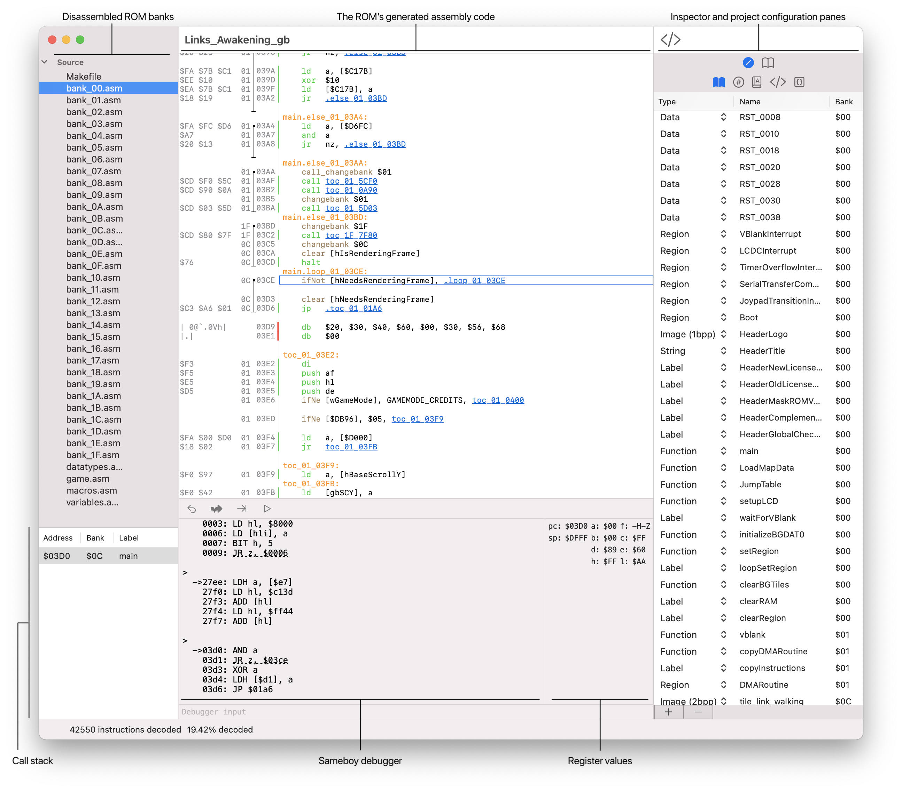
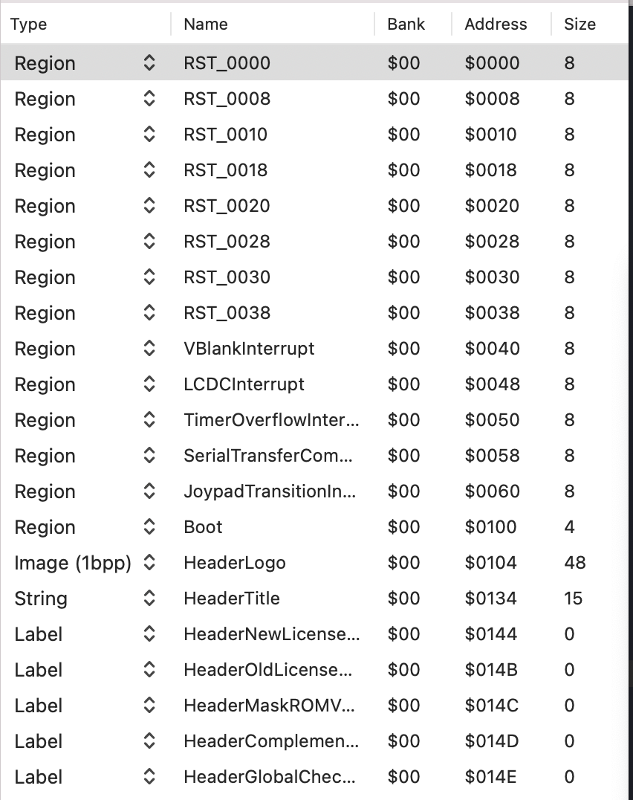

Windfish is a Gameboy ROM disassembler.
The Windfish IDE provides a user interface for editing Windfish projects and it is tightly integrated with the [Sameboy emulator](http://github.com/liJI32/SameBoy/).
Windfish is primarily intended for performing archaeological explorations of existing retro games.

## Overview

The Windfish app provides a project-based workflow for disassembling ROMs.

The leading pane is called the Navigator.
At the top, the Navigator shows all of the files that have been generated from the project's ROM.
At the bottom, the Navigator shows the call stack of the current debugging session.

The center pane consists of the Editor and Console.
The Editor provides a read-only view of the generated assembly for the ROM.
The Console provides a read-evaluate-print-loop (REPL) interface to the Sameboy emulator.
See [Sameboy's Textual Debugger Documentation](https://sameboy.github.io/debugger/) for full details on working with the debugger.

The trailing pane is called the Inspector.
The Inspector pane has nested tabs that allow you to edit and inspect the Windfish project's configuration.
The edit tab includes:

- The Region editor.
- The Data Type editor.
- The Global editor.
- The Macro editor.
- The Script editor.

The inspect tab includes:

- The Region inspector.

## Disassembling your first ROM

Windfish is a project-based disassembler that relies on your input to guide it toward an ideal disassembly.

To create a new project, open Windfish and click File > New Project.
This will create an empty project.
You can now load a ROM for disassembly into the project by clicking File > Load ROM....

Once the ROM is loaded, Windfish will immediately begin disassembling it.
Once complete, the UI will show you the list of ROM banks in the Navigator.

Clicking any of the files in the Navigator will open a read-only view of that file in the Editor.

By default, Windfish will populate the project with several regions that are standard for Gameboy ROMs.

These defaults provide a solid starting point for inspecting and understanding the ROM's behavior.
